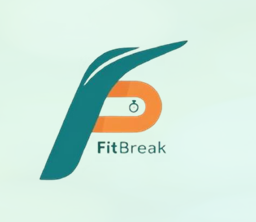

# WEB_PROJECT_EXAM

_Transform Breaks into Energizing Wellness Moments_
                
> Built with the tools and technologies: **Python**, **JavaScript**, **Flask**, **React**, **SQLAlchemy**, **HTML**, **CSS**

---

## 📚 Table of Contents

- [Overview](#overview)
- [Getting Started](#getting-started)
  - [Prerequisites](#prerequisites)

---

## 🧩 Overview

**FitBreak** is a powerful web application designed to integrate fitness seamlessly into daily routines, promoting well-being and productivity.

### 🚀 Why FitBreak?

This project transforms breaks into revitalizing moments through personalized exercise routines and reminders. The core features include:

- **🖥️ Web Server Initialization**: Simplifies backend setup, allowing developers to focus on building features.
- **🗃️ Database Management**: Efficient user data handling with SQLAlchemy.
- **📧 Email Notifications**: Keeps users informed and engaged with automated communication.
- **⏱️ Background Task Scheduling**: Executes tasks efficiently without blocking the main application.
- **🧭 Dynamic Content Management**: Smooth navigation with React and React Router.
- **🔔 Notification System**: Real-time updates to enhance interactivity and responsiveness.

---

## 🚀 Getting Started

### 📦 Prerequisites

This project requires the following dependencies:

- **Programming Language**: Python  
- **Package Manager**: Npm, Pip

---

